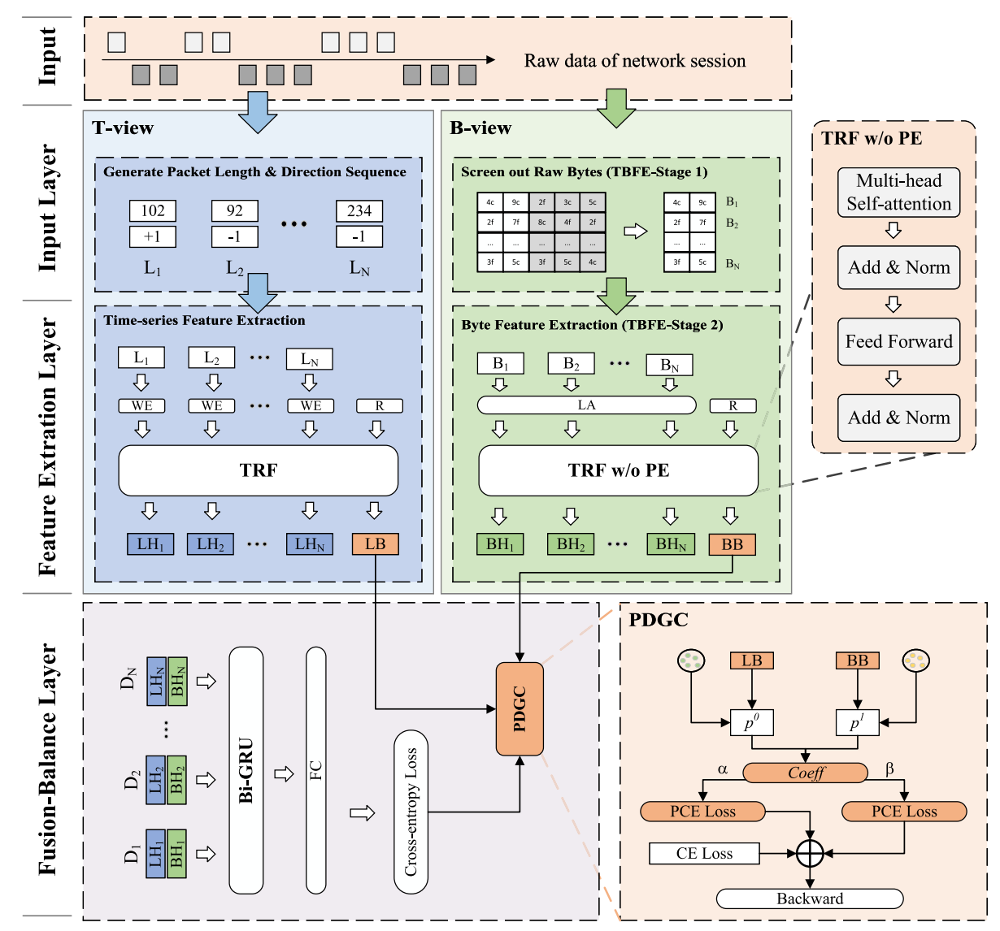
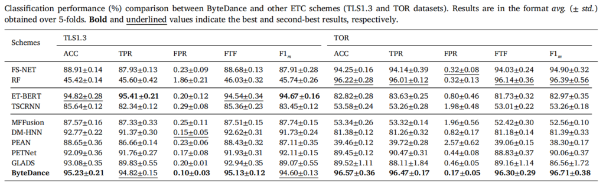
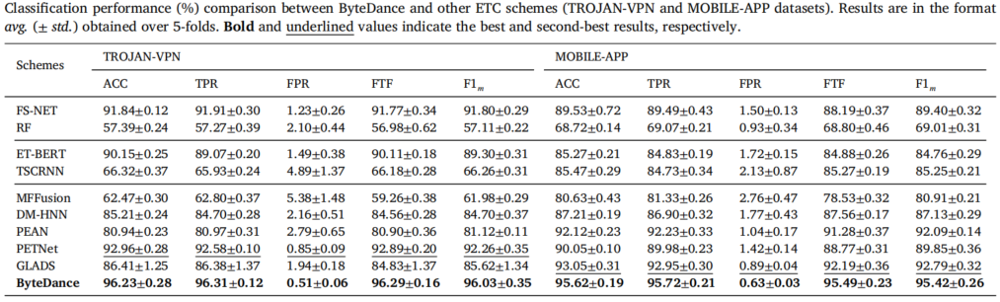

# ByteDance

## Project Overview

ByteDance is a multi-view encrypted traffic classification system that leverages both time-series and byte-level features to achieve superior performance in encrypted traffic classification.

## Paper Information

### Title
**ByteDance: Let Bytes Perform Brilliantly in Multi-view Encrypted Traffic Classification**

### Authors
Yuwei Xu, Zhiyuan Liang, Xiaotian Fang, Kehui Song, Meng Wang, Qiao Xiang and Guang Chenga,

### Publication
- **Journal**: Computer Networks
- **DOI**: [https://doi.org/10.1016/j.comnet.2025.111843](https://doi.org/10.1016/j.comnet.2025.111843)

## Abstract

The use of deep learning in encrypted traffic classification has led to two primary methodologies: the time-series view (T-view) and the byte view (B-view). T-view ETC schemes capture timing relationships in network flow, whereas B-view ETC schemes focus on byte differences in raw traffic data. Recent studies show that using multi-view learning can improve ETC performance by creating technical complementarity between T-view and B-view. However, the existing multi-view studies have failed to achieve significant improvements over single-view schemes.

Through an in-depth analysis of comparative experiments, we identify two major problems. Byte features in raw traffic are not accurately extracted, and the B-view is suppressed by the T-view during model training. To tackle the problems highlighted above, we propose ByteDance, which lets bytes play brilliantly in multi-view ETC.

To accurately capture byte features, a two-stage byte feature extraction strategy (TBFE) is proposed. It screens packet bytes by their protocol format and distribution, then employs a local attention module and a transformer encoder to extract byte features accurately. To mitigate the suppression of B-view, a prototype-network-based dynamic gradient compensation strategy (PDGC) is designed. PDGC assigns weights to gradients in each training batch, enhancing gradient propagation in the B-view with a PCE loss function.

We compare ByteDance with nine state-of-the-art ETC schemes. Experimental results show that ByteDance's classification accuracy on four datasets significantly exceeds that of the suboptimal schemes. Moreover, ByteDance leads the pack with its impressive metrics, including parameter counts, GPU memory demands, and both training and inference times for models, showcasing remarkable operating efficiency.

## System Architecture

ByteDance consists of two main components:

### 1. Two-Stage Byte Feature Extraction (TBFE)
- **Packet Byte Screening**: Filters packet bytes based on protocol format and distribution
- **Local Attention Module**: Enhances local feature extraction
- **Transformer Encoder**: Captures global byte dependencies

### 2. Prototype-Network-based Dynamic Gradient Compensation (PDGC)
- **Gradient Weight Assignment**: Balances gradients between T-view and B-view
- **PCE Loss Function**: Enhances gradient propagation in B-view

## Directory Structure

```
ByteDance/
├── dateset/                   # Dataset information and processing scripts
├── image/                     # Images for documentation
│   ├── Architecture.png       # System architecture diagram
│   ├── Performance1.png       # Experimental performance results 1
│   └── Performance2.png       # Experimental performance results 2
├── model/                     # Model implementations
│   ├── ByteDance.py           # Main ByteDance model
│   └── ByteTransformer.py     # Byte Transformer implementation
├── tools/                     # Utility scripts
│   ├── clean_pcap/            # PCAP file processing
│   ├── data_conversion/       # Data format conversion tools
│   ├── data_visualization/    # Data visualization tools
│   ├── feature_extraction/    # Traffic feature extraction
│   ├── process_json/          # JSON data processing
│   ├── time_sequence_analysis/ # Time sequence analysis
│   └── use_tools/             # Utility tools and scripts
├── BD_train.py                # Main training script
├── README.md                  # This file
└── requirements.txt           # Project dependencies
```

## Dependencies
See requirements.txt

## Installation

```bash
# Clone the repository
git clone https://github.com/xuyw-seu/ByteDance.git
cd ByteDance

# Install dependencies
pip install -r requirements.txt
```


## Datasets

ByteDance has been evaluated on four datasets:

| Dataset | Classes |
|---------|---------|
| CSTNET-TLS1.3 | 163, 51.la, 51cto, acm, adobe, alibaba, alipay, amap, apple, arxiv, baidu, bilibili, biligame, booking, chia, cloudflare, cloudfront, cnblogs, criteo, deepl, eastday, facebook, feishu, ggph, github, gmail, google, huanqiu, huawei, ibm, icloud, ieee, jd, msn, netflix, nike, office, overleaf, qq, sciencedirect, snapchat, sohu, t.co, thepaper, weibo, wikimedia, xiaomi, yahoo, youtube, zhihu |
| MOBILE-APP | facebook, instagram, linkedIn, spotify, tiktok, twitter, wikipedia, youtube |
| TOR | 163, alibaba, aliyun, amazon, apple, baidu, bilibili, bing, cdc, csdn, deepl, epicgames, github, icloud, jd, msn, office, openai, qq, sci-encodedirect, stackoverflow, tencent, weibo, yahoo, zhihu |
| TROJAN-VPN | amazon, facebook, google, nytimes, reddit, twitter, wiki, youtube, weibo |

See ' dateset/README.md ' for more details.

## Key Contributions

1. **Two-Stage Byte Feature Extraction (TBFE)**: Accurately captures byte features by screening packet bytes and employing local attention and transformer encoder.

2. **Prototype-Network-based Dynamic Gradient Compensation (PDGC)**: Mitigates B-view suppression by assigning weights to gradients and enhancing gradient propagation with PCE loss.

3. **Superior Performance**: Achieves state-of-the-art results on four datasets with efficient model design.

## Classification Performance

ByteDance has been compared with nine state-of-the-art ETC schemes. All schemes were evaluated using their optimal hyperparameters following the same comparison methodology as in previous studies. The experimental results strongly demonstrate ByteDance's exceptional performance in encrypted traffic classification tasks.

ByteDance achieved the best performance across four different encrypted traffic datasets. First, it performed outstandingly on all four datasets, achieving the highest accuracy, surpassing the suboptimal baseline by at least 0.35% and up to 3.27%. Second, ByteDance also showed significant improvements in other metrics, demonstrating better classification balance across all traffic categories compared to other schemes. It achieved the highest TPR on three datasets, slightly lower than ET-BERT on the TLS1.3 dataset. ByteDance obtained the lowest FPR values on all four datasets, with differences ranging from 0.05% to 0.34% compared to its closest competitors. ByteDance's FTF score exceeded 95% on all four datasets, outperforming all baseline schemes. Its F1<sub>m</sub> score was the highest on three datasets, trailing only ET-BERT by 0.07% on the TLS1.3 dataset.



## Citation

If you use ByteDance in your research, please cite our paper:

```bibtex
@article{XU2025111843,
    title = {ByteDance: Let bytes perform brilliantly in multi-view encrypted traffic classification},
    author = {Yuwei Xu and Zhiyuan Liang and Xiaotian Fang and Kehui Song and Meng Wang and Qiao Xiang and Guang Cheng},
    journal = {Computer Networks},
    pages = {111843},
    year = {2025},
    issn = {1389-1286},
    doi = {https://doi.org/10.1016/j.comnet.2025.111843},
    url = {https://www.sciencedirect.com/science/article/pii/S1389128625002071},
}
```

## Contact

For questions or feedback, please contact:
- Yuwei Xu: [xuyw@seu.edu.cn]

## Acknowledgments

We would like to thank all the contributors and reviewers for their valuable feedback and suggestions.

